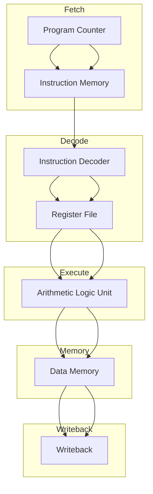
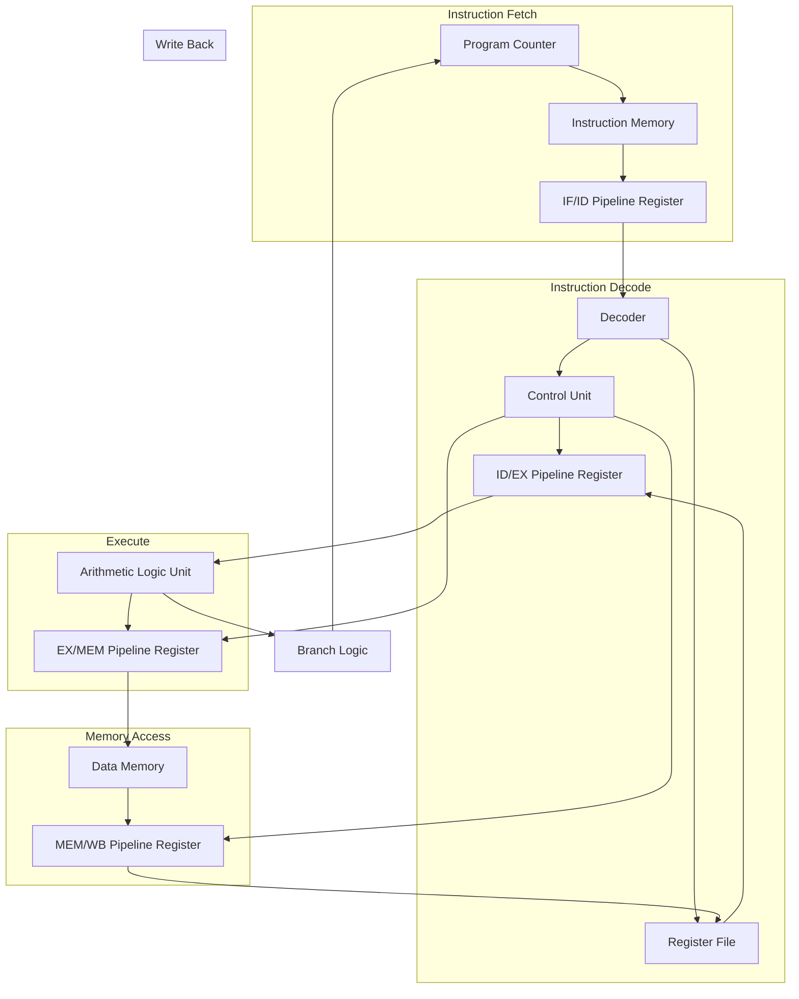

# 3. CPU Architecture

This section describes the architecture of the RISC-V CPU, including its components, pipeline stages, and data flow.

---

## Block Diagram
Below is a block diagram of the 5-stage pipeline RISC-V CPU:

## Internal Architecture

Below is a detailed diagram representing the internal architecture of the CPU and its connections:

---

## Pipeline Stages
The CPU is divided into five pipeline stages:

1. **Fetch Stage**:
   - Fetches instructions from the program memory using the Program Counter (PC).
   - Increments the PC to point to the next instruction.

2. **Decode Stage**:
   - Decodes the fetched instruction.
   - Reads operands from the register file.
   - Generates control signals for the Execute stage.

3. **Execute Stage**:
   - Performs arithmetic and logical operations using the ALU.
   - Computes branch targets and evaluates branch conditions.

4. **Memory Stage**:
   - Accesses data memory for load/store operations.
   - Passes results to the Writeback stage.

5. **Writeback Stage**:
   - Writes results back to the register file.
   - Updates the PC for the next instruction.

---

## Key Components
- **Program Counter (PC)**: Tracks the address of the next instruction to fetch.
- **Instruction Memory**: Stores the program instructions.
- **Register File**: Contains 32 general-purpose registers.
- **Arithmetic Logic Unit (ALU)**: Performs arithmetic and logical operations.
- **Data Memory**: Stores data for load/store operations.
- **Control Unit**: Generates control signals based on the instruction.

---

## Data Flow
1. Instructions are fetched from the program memory.
2. The instruction is decoded, and operands are read from the register file.
3. The ALU performs the required operation.
4. Data memory is accessed if needed.
5. Results are written back to the register file.

---

## Next Steps
- Explore the supported RISC-V instructions in [Instruction Set](4_instruction_set.md).
- Learn how to simulate the CPU in [Simulation and Testing](5_simulation_testing.md).